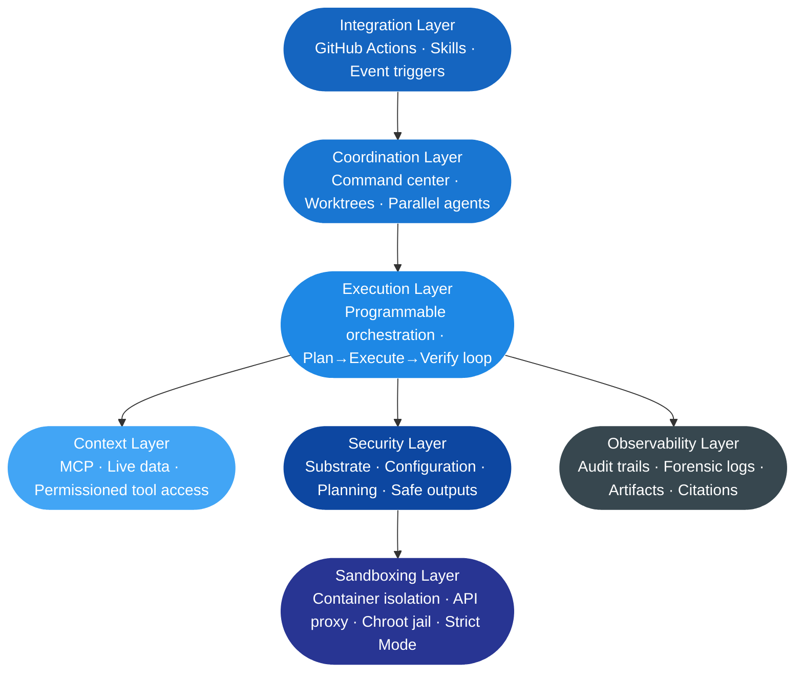

# 8. Architecture for AI-Driven Development Platforms

## 8.1 The Architectural Problem: Why Purpose-Built Infrastructure Is Required

Moving from AI tools embedded in an IDE to AI workflows embedded in the software delivery lifecycle is not primarily a capability problem — it is an infrastructure problem. The tools required to support autonomous agents operating on production codebases, CI/CD systems, and external integrations do not exist in the existing development toolchain. They must be built or adopted as a distinct platform layer.

The reasons are structural. Existing CI/CD infrastructure was designed for deterministic automation: fixed scripts, predictable inputs, known outputs. Agents are non-deterministic. They consume untrusted inputs, reason over repository state, make runtime decisions, and invoke tools in sequences that cannot be fully anticipated at design time. Combining non-deterministic agents with the highly permissive execution environments of existing CI/CD systems — where components share a single trust domain — creates a large blast radius if something goes wrong. A shared trust domain is a feature for deterministic automation. It is a liability for agentic execution.

This section describes the architectural layers that purpose-built AI development platforms have implemented to address these requirements: execution, context, security, sandboxing, coordination, observability, and SDLC integration.

---

## 8.2 The Execution Layer: Programmable Agent Orchestration

The foundational shift in AI platform architecture is the emergence of a programmable execution layer — the capability for applications to invoke agentic planning and execution as an infrastructure primitive, not a feature of a specific tool.

The GitHub Copilot SDK makes this concrete. Rather than requiring teams to build their own orchestration stack, the SDK exposes the same production-tested planning and execution engine that powers GitHub Copilot CLI as a programmable capability inside any application. If an application can trigger logic, it can trigger agentic execution. *(Source: Davis, G., GitHub Blog, March 10, 2026 — [github.blog](https://github.blog/ai-and-ml/github-copilot/the-era-of-ai-as-text-is-over-execution-is-the-new-interface/))*

This is the architectural shift from "AI as text" to "AI as execution." Prior generations of AI integration produced text output that a human or downstream process had to act on. Execution-layer integration means the agent itself invokes tools, modifies files, runs commands, queries systems, and surfaces results — within defined constraints — without a human mediating each step. The application defines intent and boundaries; the execution layer handles the planning and action loop.

---

## 8.3 The Context Layer: Model Context Protocol

Reliable autonomous execution depends on access to accurate, structured, permissioned context at runtime. An agent that reasons from stale or approximate information embedded in a prompt will produce stale or approximate results. Scaling autonomous workflows requires replacing prompt-based context encoding with a structured protocol for live data access.

The Model Context Protocol (MCP) is the architectural standard that provides this layer. MCP defines how agents connect to live data sources during planning and execution: service ownership registries, dependency graphs, historical decision records, internal API schemas, repository metadata. Rather than stuffing this information into prompts — which makes workflows brittle, hard to test, and difficult to evolve — MCP exposes it as structured, permissioned tools that the agent queries at runtime.

The governance consequence is significant. MCP access to internal systems is permissioned and auditable. The agent accesses exactly the systems it has been granted access to, through defined interfaces, with the queries logged. This is architecturally different from an agent operating on context that was embedded in a prompt at initialization time, where the boundary of what the agent knows is opaque and unaudited.

---

## 8.4 The Security Layer: Defense in Depth

The security architecture of production AI development platforms reflects a deliberate threat model. GitHub's Agentic Workflows documentation identifies the core threat as the combination of agent non-determinism and highly permissive execution environments. An agent that can be prompt-injected and that has access to secrets, shell commands, and network egress can leak credentials, spam repositories, or execute unauthorized writes at scale. The security architecture addresses this at every layer.

GitHub Agentic Workflows implement a three-layer security model: *(Source: Cox, L. & Zhou, J., GitHub Blog, March 9, 2026 — [github.blog](https://github.blog/ai-and-ml/generative-ai/under-the-hood-security-architecture-of-github-agentic-workflows/))*

**Substrate layer.** The foundation: a GitHub Actions runner VM and trusted containers that provide isolation between components, mediation of privileged operations and system calls, and kernel-enforced communication boundaries. These protections hold even if an untrusted user-level component within its container boundary is compromised.

**Configuration layer.** Declarative artifacts and the toolchains that interpret them: which components are loaded, how they are connected, what communication channels are permitted, what privileges are assigned. External tokens (agent API keys, GitHub access tokens) are critical configuration inputs — the configuration layer controls which tokens are available to which containers, not which agents.

**Planning layer.** The final defense: a staged workflow with explicit data exchanges between stages. The planning layer's primary mechanism is the safe outputs subsystem, which buffers all agent write operations for deterministic vetting before execution.

The four security principles that govern these layers:

1. **Defense in depth** — each layer limits the impact of failures above it
2. **Zero secrets to agents** — LLM authentication tokens reside in an isolated API proxy; MCP authentication material lives in a dedicated MCP gateway; the agent container itself receives no secrets
3. **Stage and vet all writes** — the agent can only stage updates through a safe outputs MCP server; those updates pass through filter operations, content moderation, and secret removal before any write executes
4. **Log everything** — network activity, model request/response metadata, tool invocations, and sensitive environment variable accesses are all logged at trust boundaries, enabling end-to-end forensic reconstruction

---

## 8.5 The Sandboxing Layer: Runtime Isolation

Sandboxing is the runtime enforcement of the security architecture — the mechanism that ensures agents operate within defined boundaries regardless of what they attempt.

GitHub Agentic Workflows isolate the agent in a dedicated container with tightly controlled egress: firewalled internet access, MCP access routed through the trusted MCP gateway, and LLM API calls routed through the API proxy. The agent runs in a `chroot` jail with the host file system mounted read-only at `/host`, overlaid with empty writable `tmpfs` layers. The agent's writable and discoverable surface is constrained to what it needs for its task.

OpenAI's GPT-5.3-Codex and the Codex app use native, open-source, system-level sandboxing. By default, agents are limited to editing files in the designated folder or branch and using cached web search. Commands requiring elevated permissions — network access, external API calls — require explicit configuration via project or team rules. The model is: secure by default, configurable by design.

Antigravity implements Strict Mode at the application layer: the agent must request permission before acting outside its predefined scope, creating a human-in-the-loop gate at the boundary of the agent's authorized action space.

---

## 8.6 The Coordination Layer: Multi-Agent Command Surfaces

As autonomous workflows mature from single-agent tasks to coordinated teams of agents operating in parallel, the coordination layer becomes the surface through which developers direct, supervise, and manage that work at scale.

OpenAI's Codex app is purpose-built for this layer: a command center where agents run in separate threads organized by project, with built-in worktree support allowing multiple agents to operate on the same repository without conflicts — each on an isolated copy of the codebase. The developer reviews diffs, comments on changes, and decides which paths to continue without managing individual execution steps. The coordination surface is designed around outcomes, not steps.

The Codex app also introduces Skills: bundles of instructions, resources, and scripts that extend agent capabilities to specific tools and workflows — Figma design implementation, Linear project management, Cloudflare and Vercel deployment, image generation, documentation creation. Skills can be checked into repositories for team-wide sharing, making the agent's extended capabilities part of the codebase rather than personal configuration.

The architectural implication is the emergence of a distinct orchestration surface in the development platform stack — neither an IDE nor a terminal, but a coordination layer that manages agent teams the way project management tooling manages human teams.

---

## 8.7 The Observability Layer: Audit Infrastructure

Observability is not an add-on to the AI development platform architecture — it is a first-class property of it. Agents that cannot be audited cannot be trusted in production, and platforms that do not make audit trails a structural output cannot satisfy the compliance requirements of regulated environments.

GitHub Agentic Workflows log at every trust boundary: network and destination-level activity at the firewall, model request/response metadata at the API proxy, tool invocations at the MCP gateway and MCP servers, and environment variable accesses inside the agent container. Together, these logs support end-to-end forensic reconstruction of any agent execution — what the agent planned, what it queried, what it attempted to write, and what the safe outputs layer vetted or blocked.

OpenAI Codex provides citations: terminal logs, test outputs, and file path references associated with each task, allowing engineers to reconstruct the complete execution path. Antigravity produces structured Artifacts at task boundaries: task lists, implementation plans, walkthroughs, and browser recordings. These are not raw logs; they are task-level summaries structured for human review at the level of decisions, not individual tool invocations.

The observability layer also enables continuous improvement. Pervasive logging at communication boundaries, as GitHub documents, is also the foundation for future information-flow controls: every location where communication can be observed is a location where it can be mediated and policy-enforced.

---

## 8.8 The Integration Layer: Connecting to the SDLC

The final architectural layer is integration — the mechanism through which autonomous AI workflows connect to the existing software delivery lifecycle rather than operating as a parallel track.

GitHub Actions serves as the CI-triggered execution surface for Agentic Workflows: agents are invoked by workflow events (push, pull request, issue assignment, scheduled trigger) and execute within the Actions runner environment with the security architecture described above. This makes agentic execution a first-class citizen of the CI/CD pipeline rather than an external tool that must be integrated separately.

OpenAI's Skills architecture extends integration across the tool ecosystem: each Skill is a portable capability bundle that connects the agent to a specific external system — the Figma Skill enables design-to-code translation; the Linear Skill connects to project management; the deployment Skills connect to hosting platforms; the OpenAI Docs Skill grounds API development in current documentation. Skills are composable and team-shareable, making the integration layer part of the repository rather than individual developer configuration.

Event-driven invocation is the integration pattern that ultimately makes autonomous AI workflows infrastructure rather than tooling. An agent responds to a CI failure, an issue assignment, a file change, a deployment trigger — not to a developer opening a tool. The agent is part of the system's response to events, not a separate tool a developer chooses to consult.

---

## 8.9 The Platform Stack: Layers Working Together

The seven layers described in this section do not operate independently — they form a coherent platform stack. Each layer has defined responsibilities and defined interfaces to the layers adjacent to it.

The execution layer is the core: the programmable planning and execution loop that drives autonomous work. The context layer grounds it in real data. The security layer constrains it within defined boundaries. The sandboxing layer enforces those boundaries at runtime. The coordination layer provides the human-facing surface for managing agent teams. The integration layer connects the stack to the existing SDLC. The observability layer makes everything that happens inside the stack auditable and reconstructable.

For organizations evaluating AI development platforms, this architecture provides the evaluation framework. A platform that handles execution without addressing security, or that provides coordination without observability, is incomplete. The platforms that reach production-grade deployment at scale are the ones that have built all seven layers — and that expose them as configurable infrastructure rather than fixed features.

The next section examines how organizations move from this architecture to production implementation: the sequenced steps, decision points, and change management requirements for deploying autonomous AI development capabilities across an engineering organization.

---

*Previous: [← 7. Autonomous AI Development Workflows](autonomous-workflows.md)*
*Next: [9. Implementing Autonomous Development Platforms →](implementation.md)*
