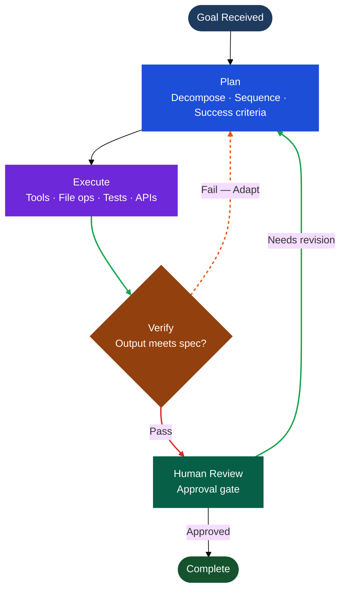

# 7. Autonomous AI Development Workflows

## 7.1 What “Autonomous” Actually Means in Practice

The word autonomous carries significant weight — and significant risk of misinterpretation. In the context of software development, autonomous does not mean unsupervised. It does not mean AI operating without human-defined constraints or human review of consequential outputs. It means something more precise: AI that can receive a goal, plan the steps required to achieve it, execute those steps across real tools and systems, verify its own output, recover from failure, and surface results for human review — without requiring a human prompt at every intermediate step.

This distinction matters because the difference between a system that is autonomous and one that is merely automated is the presence of adaptive reasoning under uncertainty. A CI/CD pipeline that runs tests on every commit is automated. An agent that investigates a test failure, traces it to a root cause, proposes a fix, applies it, re-runs the suite, and opens a pull request with annotated evidence is autonomous. The first follows a fixed script. The second exercises judgment within defined boundaries.

The workflows examined in this section are in production use as of early 2026. They are not research prototypes.

---

## 7.2 The Architecture of an Autonomous Workflow

Every autonomous development workflow — regardless of the platform it runs on — shares a common underlying structure. Understanding this structure is prerequisite to designing, deploying, and governing autonomous workflows effectively.

The four-stage loop that defines autonomous execution:

**1. Plan.** Given a goal and available context, the agent decomposes the task into steps: what files to examine, what tools to invoke, what sequence of actions is required, and what success looks like. This planning step is what distinguishes agentic systems from scripted automation — the agent reasons about the task rather than executing a predefined path.

**2. Execute.** The agent invokes tools — file reads and writes, terminal commands, test runners, web search, API calls, deployment scripts — in the sequence determined during planning. Each action produces observable state that feeds into the next decision.

**3. Verify.** The agent checks its own output: do tests pass? Does the implementation match the specification? Are there regressions? Does the result meet the quality bar defined in the task? Verification is not optional — it is what separates agentic execution from AI-assisted generation, where correctness depends entirely on human review.

**4. Adapt.** If verification reveals a gap — a failing test, an unexpected error, a result that does not meet the specification — the agent revises its approach and re-executes. Recovery from failure is a first-class capability, not a fallback.

This loop runs within constraints defined by the organization: permission boundaries, sandboxing rules, escalation thresholds, and approval gates that determine when human review is required before the workflow continues.

---

## 7.3 Three Deployment Patterns

Three concrete patterns represent how organizations are embedding autonomous execution into their development infrastructure today.

**Pattern 1: Intent delegation.** The application or developer specifies a goal — “prepare this repository for release,” “investigate and fix the failing CI suite,” “refactor this module to the new API” — and the agent plans and executes the required steps autonomously. Rather than encoding fixed procedures, the system delegates intent and operates under defined constraints. This pattern replaces brittle scripts with adaptive execution that can handle context, mid-run changes, and error recovery without hard-coded edge case handling.

**Pattern 2: Runtime context grounding via MCP.** Reliable autonomous workflows depend on structured, permissioned access to real systems — not on encoding system logic in prompts. The Model Context Protocol (MCP) provides the architectural layer that connects agents to live data sources at runtime: service ownership registries, dependency graphs, historical decision records, internal APIs, schema definitions. An agent operating with MCP access queries the actual state of a system before taking action, rather than reasoning from static context embedded in a prompt window. This grounds execution in reality rather than in the agent’s approximation of it.

*(Source: Davis, G., “The Era of ‘AI as Text’ Is Over. Execution Is the New Interface,” GitHub Blog, March 10, 2026 — [github.blog](https://github.blog/ai-and-ml/github-copilot/the-era-of-ai-as-text-is-over-execution-is-the-new-interface/))*

**Pattern 3: Embedded execution across the stack.** Autonomous workflows are not confined to IDEs or developer terminals. They run inside desktop applications, background services, SaaS platforms, and event-driven pipelines. An event — a file change, deployment trigger, CI failure notification, issue assignment — invokes the agent programmatically. The planning and execution loop runs as application-layer infrastructure, available wherever the software runs. As GitHub frames it: “AI stops being a helper in a side window and becomes infrastructure.”

---

## 7.4 Multi-Agent Coordination: Teams of Agents

The next layer of autonomous workflow design is coordination: not a single agent executing a single task, but multiple agents working on parallel tasks, across parallel workspaces, simultaneously — with a human orchestrating at the level of goals, not steps.

This is the model that OpenAI’s Codex app (February 2, 2026) and Google Antigravity are built to support. OpenAI describes the shift precisely: *“The core challenge has shifted from what agents can do to how people can direct, supervise, and collaborate with them at scale.”* Existing IDEs and terminal tools, designed for serial developer workflows, are not built for this pattern.

In the Codex app, agents run in separate threads organized by project. Multiple agents can work on the same repository simultaneously using isolated worktrees — each operating on its own copy of the codebase — eliminating conflicts while enabling true parallelism. A developer reviews results, comments on diffs, and decides which paths to continue, interacting at the level of outcomes rather than individual steps.

In Google Antigravity’s Manager surface, the developer functions as an orchestrator: spawning agents across multiple workspaces, assigning tasks asynchronously, monitoring progress through structured artifacts (task lists, implementation plans, walkthroughs, browser recordings), and providing feedback mid-execution without stopping the agent’s process. Agents draw from and contribute to a persistent knowledge base, so learning from one task is available across subsequent ones.

*(Source: OpenAI, “Introducing the Codex App,” February 2, 2026 — [openai.com](https://openai.com/index/introducing-the-codex-app/))*

The practical implication for engineering organizations is significant: the bottleneck in high-velocity development shifts from execution capacity to review and direction capacity. Teams that build the habits and tooling to supervise agents effectively — not just to use them individually — will operate at a qualitatively different level of throughput.

---

## 7.5 Automations: Agents That Run on Schedule

Beyond on-demand task delegation, autonomous workflows include a class of scheduled, recurring agents that run without a human trigger at all. OpenAI refers to these as **Automations**: combinations of instructions and skills that execute on a defined schedule, with results queued for human review.

OpenAI’s own engineering teams use Automations for daily issue triage, CI failure detection and summarization, release brief generation, dependency health checks, and recurring test coverage audits. These are tasks that previously required a human to initiate and monitor — now handled by background agents that surface findings rather than waiting to be asked.

Antigravity implements a parallel model: agents operate across surfaces autonomously while the developer focuses on a separate task in the foreground. The Inbox surface captures completions and escalations, so the developer re-engages at natural review points rather than monitoring agent activity in real time.

The design principle underlying both approaches is the same: asynchronous collaboration with agents mirrors asynchronous collaboration with human colleagues. The agent works; the human reviews; the cycle continues without requiring synchronous attention at each step.

---

## 7.6 Human-in-the-Loop: Where Review Must Happen

Autonomy does not eliminate human judgment — it restructures where that judgment is applied. Effective autonomous workflow design requires explicit decisions about where in the execution loop a human must review and approve before the workflow continues. Getting this wrong in either direction creates problems: too many interruptions eliminate the productivity gain; too few create governance exposure.

The principle that emerges from production deployments is **risk-proportionate review**. Humans are engaged at points where decisions are consequential, irreversible, or outside the agent’s verified competence — not at every step:

- **Low-risk, reversible actions** (reading files, running tests, opening draft PRs, generating documentation) proceed autonomously without approval.
- **Medium-risk actions** (merging to main, modifying shared infrastructure, invoking external APIs) require human confirmation before execution.
- **High-risk actions** (production deployments, credential access, security-sensitive operations) require explicit human initiation and cannot be delegated without elevated approval.

GPT-5.3-Codex runs in isolated sandboxes with internet access disabled during task execution by default. Elevated permissions require explicit organizational configuration. Antigravity’s Strict Mode adds a further layer: the agent must request permission before taking actions outside its predefined scope.

The governance implication is that the permission model is not a feature to configure after deployment. It is an architectural decision that must be made before autonomous workflows enter production.

---

## 7.7 Audit Trails and Verifiability

Autonomous workflows that cannot be audited cannot be trusted in production. Every major platform addresses this requirement, but the mechanism differs.

OpenAI’s Codex provides **citations**: terminal logs, test outputs, and file path references that allow engineers to trace every action the agent took during a task. The principle is verifiability — the human reviewing the result can reconstruct exactly what happened and why.

Antigravity produces **Artifacts** at each stage of execution: task lists before implementation begins, implementation plans after research completes, walkthroughs at completion, and screenshots and browser recordings for UI-affecting changes. These are not raw logs — they are task-level summaries structured for human review.

GitHub Agentic Workflows provide sandboxed execution with constrained outputs and comprehensive logging, designed explicitly to satisfy audit requirements. The threat model — prompt injection, credential leakage, unauthorized repository writes — is documented and addressed architecturally.

For engineering organizations subject to compliance requirements — SOC 2, ISO 27001, financial services regulations — the auditability of autonomous workflows is a prerequisite for production use. The platforms that make audit trails a first-class output are the ones deployable in regulated environments.

---

## 7.8 Workflow Integration: From Standalone Agents to Development Infrastructure

The trajectory of autonomous AI development workflows points toward deep integration with the existing software delivery lifecycle — not operation as a parallel, separate track.

As of early 2026, integrations in production or technical preview include: GitHub Actions (agents triggered by CI events), issue trackers (Linear, GitHub Issues — agents triaging, labeling, assigning), design tools (Figma — agents translating designs to production-ready code with 1:1 visual parity), deployment platforms (Vercel, Cloudflare, Netlify, Render — agents deploying completed features), and monitoring systems (agents investigating failures and proposing fixes).

OpenAI’s stated direction makes the endpoint explicit: *“Developers will soon be able to assign tasks from Codex CLI, ChatGPT Desktop, or even tools such as your issue tracker or CI system.”* The workflow surface is wherever work is tracked — and the agent responds there, not just inside an IDE.

For organizations designing their development infrastructure, this means autonomous AI workflows are not a category of tool to adopt separately. They are becoming the connective tissue of the software delivery lifecycle — the layer that connects issue identification to implementation to verification to deployment, with human review at the consequential junctures and autonomous execution everywhere in between.

---

## 7.9 What Organizations Must Build Before Deploying Autonomous Workflows

Production autonomous workflows do not emerge from tool adoption alone. They require organizational infrastructure that most engineering teams are still building. Four prerequisites stand out:

**1. A defined permission and sandboxing model.** Before any autonomous workflow touches production systems, the organization must define what agents can and cannot do without human approval. This is a deliberate design decision that must account for the sensitivity of the codebase, the compliance requirements of the environment, and the maturity of the team’s review processes.

**2. Structured codebase documentation.** Agents operate at the quality of the context they can access. AGENTS.md files, architecture decision records, service ownership registries, and well-maintained test suites are prerequisites for reliable autonomous execution. An agent working against an undocumented codebase will produce undocumented behavior.

**3. A review culture adapted for agent output.** Reviewing AI-generated pull requests is a different skill from reviewing human-written code. The volume is higher, the patterns are different, and the failure modes are distinct. Organizations that invest in training their teams to review agent output effectively — what to look for, how to interpret citations and audit trails, how to give feedback that improves future performance — extract substantially more value from autonomous workflows than those that apply existing review practices unchanged.

**4. Graduated deployment.** Autonomous workflows should be introduced incrementally: low-stakes, high-volume tasks first (test generation, documentation, issue triage); medium-stakes tasks with established review gates second; high-stakes tasks only after the permission model, audit infrastructure, and review culture are in place. Each stage of graduation is a deliberate checkpoint, not an obstacle.

The organizations that move through these stages systematically are the ones that reach production-grade autonomous workflows without the governance incidents that derail less deliberate approaches. The next section examines the architectural components — the platform layer — that makes that progression possible at scale.

---

*Previous: [← 6. Harnessing AI in Software Development](harnessing-ai.md)*
*Next: [8. Architecture for AI-Driven Development Platforms →](architecture.md)*
