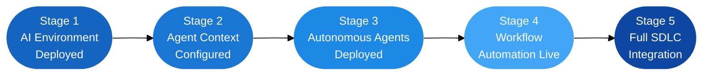

# 9. Implementing Autonomous Development Platforms

## 9.1 From Architecture to Deployment: The Implementation Challenge

The architectural layers described in Section 8 represent the platform requirements for autonomous AI development at scale. They also represent a gap. Most engineering organizations today are not operating at that architecture — they are somewhere earlier in a progression that spans from AI tool adoption to autonomous workflow integration, with most teams concentrated in the first two stages.

The implementation challenge is not primarily technical. The platforms, models, and protocols described in this whitepaper are available today, and most are accessible on standard developer or enterprise plans. The challenge is organizational: sequencing adoption correctly, building infrastructure prerequisites in the right order, and establishing governance and review culture before deploying capabilities that require them.

This section describes the five-step implementation path that organizations are following in early 2026 to move from AI tool adoption to production autonomous workflows — along with the governance requirements and staged rollout model that make the progression sustainable.

---

## 9.2 Step 1: Deploying the AI Development Environment

The starting point for every organization is the AI development environment: the coding workspace, model access, and enterprise policy controls that establish the foundation for everything that follows.

As of early 2026, the primary enterprise-grade AI development environments are:

| Platform | Developer Surface | Enterprise Controls | Underlying Models |
|---|---|---|---|
| **GitHub Copilot Enterprise** | VS Code, JetBrains, Visual Studio, CLI, GitHub.com | SSO, policy management, audit logs, model selection | GPT-5.3-Codex, Claude Sonnet 4.6, Gemini 3.1 Pro |
| **Google Antigravity** | Antigravity IDE (web + desktop) | Manager surface, shared knowledge base, permission tiers | Gemini 3, Claude Sonnet 4.5, GPT-OSS |
| **OpenAI Codex App** | Web app, Codex CLI | Team rules, permission configuration, audit logs | GPT-5.3-Codex |
| **Anthropic Claude Code** | Terminal / CLI, IDE integrations | CLAUDE.md configuration, permission controls | Claude Sonnet 4.6 |

Enterprise deployment at this stage involves four configuration decisions: identity integration (SSO/SAML), data policy (whether to allow the vendor to use prompts for model training — most enterprises opt out), model selection (which LLMs are permitted by organizational policy), and seat assignment (which teams or roles receive access, typically starting with platform engineers or early-adopter product teams).

GitHub Copilot Business and Enterprise allow administrators to configure all of these through organization-level policy controls, with granular settings for which Copilot features are enabled and which models can be invoked. *(Source: GitHub Documentation, "About Copilot Coding Agent," 2026 — [docs.github.com](https://docs.github.com/en/copilot/using-github-copilot/coding-agent/about-copilot-coding-agent))*

The implementation risk at this stage is under-configuration: deploying AI tools without establishing data policies, audit logging, or model controls, and having to retrofit those governance decisions after the tools are already in active use across engineering teams.

---

## 9.3 Step 2: Grounding Agents with Configurable Standards and Instructions

The single highest-leverage implementation step — and the one most often skipped — is encoding organizational context into the persistent instruction files that ground agents in the codebase, coding standards, and team conventions.

Agents that operate without this grounding produce generic output that requires significant human editing to meet team standards. Agents that operate with accurate, current grounding produce output that is team-consistent, architecture-aware, and ready for review without remediation.

Each major platform provides a mechanism for this:

**AGENTS.md (GitHub Copilot Coding Agent).** A Markdown file placed in the repository root, `docs/` directory, or `.github/` folder. The coding agent reads AGENTS.md before beginning any task, using it to understand the codebase structure, coding conventions, testing requirements, PR standards, and any workflow-specific instructions. AGENTS.md files can be repository-level (applying to a specific codebase) or organization-level (applying across all repositories with a fallback hierarchy). *(Source: GitHub Documentation, "About Copilot Coding Agent," 2026 — [docs.github.com](https://docs.github.com/en/copilot/using-github-copilot/coding-agent/about-copilot-coding-agent))*

**CLAUDE.md (Anthropic Claude Code).** A project-specific instruction file that Claude Code reads on initialization, providing the agent with repository context, build commands, test procedures, coding style guides, and any project-specific constraints. CLAUDE.md persists across Claude Code sessions, so context is not re-specified at each invocation. *(Source: Anthropic, "Claude Code Overview," 2026 — [docs.anthropic.com](https://docs.anthropic.com/en/docs/claude-code/overview))*

**Antigravity Knowledge Base.** Antigravity builds and maintains a persistent knowledge base populated across agent sessions — architecture decisions, component inventories, historical task resolutions, and coding standards. Unlike static files, the knowledge base evolves as agents complete tasks, ensuring subsequent agents benefit from prior work. *(Source: The Antigravity Team, "Introducing Google Antigravity," November 18, 2025 — [antigravity.google](https://antigravity.google/blog/introducing-google-antigravity))*

What these files contain matters as much as whether they exist. Effective grounding documents specify: the project's architecture patterns and component structure; the testing framework and coverage expectations; the PR creation conventions including title formats, description templates, and linked issue requirements; security practices such as input validation standards and dependency approval workflows; and any constraints the agent must respect — files or directories it should not modify, external systems it should not call, and thresholds above which it should escalate rather than proceed.

---

## 9.4 Step 3: Deploying Autonomous Agent Capabilities

With the environment configured and grounding documents in place, the third step is deploying autonomous agent capabilities — starting with bounded, low-risk task categories and expanding as the team's review capacity and confidence mature.

**GitHub Copilot Coding Agent** can be activated on any repository where an administrator has enabled it. To assign a task, a developer opens a GitHub issue, writes the task description — which becomes the agent's goal — and assigns the issue to Copilot. The agent then reads the repository and AGENTS.md, plans the implementation steps, executes in a GitHub Actions sandbox running tests and modifying files, and opens a pull request with a description, the set of changes made, and links to the test run. The developer reviews the PR, comments on specific lines or requests changes, and the agent can update its implementation in response to review feedback without a new issue being created. *(Source: GitHub Documentation, "About Copilot Coding Agent," 2026 — [docs.github.com](https://docs.github.com/en/copilot/using-github-copilot/coding-agent/about-copilot-coding-agent))*

**OpenAI Codex App** deploys as a parallel command center. Developers assign tasks through the Codex web UI or CLI, agents run in isolated threads, and all results surface as diffs for review. Multiple agents can operate on the same repository using separate worktrees, enabling parallel feature development without conflicts. *(Source: OpenAI, "Introducing the Codex App," February 2, 2026 — [openai.com](https://openai.com/index/introducing-the-codex-app/))*

The graduated deployment sequence that production teams follow:

| Stage | Task Category | Examples | Review Requirement |
|---|---|---|---|
| **Initial** | Low-risk, high-volume | Test generation, documentation, code comments, issue labeling | PR review before merge |
| **Intermediate** | Bounded feature work | Bug fixes, small feature implementation, refactoring | PR review + test run verification |
| **Advanced** | Multi-step autonomous tasks | Full feature implementation, migration scripts, CI/CD pipeline updates | PR review + security scan |
| **Integrated** | Event-driven autonomous responses | CI failure remediation, dependency updates, deployment verification | Async review with escalation gates |

By March 2026, 12,000+ organizations had enabled automatic AI code review by default on GitHub. Enterprise teams that embedded AI into mandatory review workflows — rather than treating it as optional tooling — reported substantially higher adoption and measurably faster delivery. WEX reported shipping approximately 30% more code after making AI code review the default across all repositories. *(Source: Gopu, R. & Apirian, D., "60 Million Copilot Code Reviews and Counting," GitHub Blog, March 5, 2026 — [github.blog](https://github.blog/ai-and-ml/github-copilot/60-million-copilot-code-reviews-and-counting/))*

---

## 9.5 Step 4: Wiring Workflow Automation

The fourth implementation step moves from on-demand agent invocation to embedded workflow automation: agents that run on schedule, on event, or on CI trigger without a developer opening a tool.

**GitHub Actions as the trigger surface.** GitHub Copilot Coding Agent integrates natively with GitHub Actions, meaning any workflow event — a push to a branch, a CI failure, a pull request comment, a scheduled cron trigger — can invoke the agent programmatically. This is what makes agentic execution a first-class citizen of the CI/CD pipeline rather than a separate tool. The agent responds to the system's events, not to a developer's manual invocation.

**OpenAI Automations.** Automations are pre-configured agent tasks — combinations of instructions and Skills — that run on a defined schedule with results queued for human review. OpenAI's own engineering teams use Automations for: daily GitHub issue triage (categorizing, labeling, and assigning incoming issues), CI failure summarization (identifying patterns across failing test runs), release brief generation (summarizing changes across a sprint for stakeholder communication), and dependency health audits (checking for outdated or vulnerable dependencies and opening patch PRs). *(Source: OpenAI, "Introducing the Codex App," February 2, 2026 — [openai.com](https://openai.com/index/introducing-the-codex-app/))*

**Skills bundles.** Skills extend agent reach across the tool ecosystem. The Figma Skill enables the agent to pull design specifications and implement pixel-accurate UI components. The Linear Skill connects to project management: reading sprint context, updating issue status, and creating new issues based on discovered work. The Vercel, Cloudflare, and Netlify Skills enable the agent to deploy completed features directly to staging and production environments. Skills are checked into repositories for team-wide sharing, making integration capabilities part of the codebase rather than personal developer configuration.

---

## 9.6 Step 5: Integrating with Development Infrastructure

The fifth step — and the one that completes the transition from tool adoption to development infrastructure — is connecting autonomous workflows to the full software delivery lifecycle.

The integration points that production teams are activating in early 2026:

**Issue trackers.** GitHub Issues and Linear receive agent-created tasks, status updates, and completion reports. Agents read issue context before beginning work and update issue state on completion, keeping project tracking synchronized with development activity without manual updates.

**CI/CD pipelines.** Beyond GitHub Actions, autonomous agents integrate with external CI systems through webhook triggers and API calls. An agent can be invoked on pipeline failure, investigate the error, propose a fix, and open a PR — all before a human engineer has reviewed the failure notification.

**MCP server configuration for internal systems.** For organizations with internal APIs, service registries, or proprietary databases, MCP server configuration is the integration mechanism that makes those systems accessible to agents at runtime. Each internal system exposed via an MCP server becomes a tool the agent can query — with permissioned access, audited queries, and no requirement to embed internal system knowledge in static prompts. Rather than encoding system state in prompts, the agent queries live reality through defined interfaces. *(Source: Davis, G., "The Era of 'AI as Text' Is Over," GitHub Blog, March 10, 2026 — [github.blog](https://github.blog/ai-and-ml/github-copilot/the-era-of-ai-as-text-is-over-execution-is-the-new-interface/))*

**Deployment platforms.** The Skills integrations with Vercel, Cloudflare, and Netlify extend the agent's scope past the repository boundary: the agent that implements a feature can also deploy it to staging, run smoke tests, and open a deployment confirmation PR — closing the loop from implementation to production verification without requiring a separate manual deployment step.

---

## 9.7 Governance, Policy, and Audit Setup

Implementation without governance is the failure pattern that creates organizational incidents and erodes confidence in autonomous workflows. Governance setup is not a final step — it is a precondition that must be in place before agents touch production systems.

Three governance elements must be established before advancing past Stage 1 deployment:

**Permission model configuration.** Based on the risk-proportionate framework described in Section 7.6, the organization must define which actions agents can take without human approval, which require confirmation before execution, and which require explicit human initiation. This is configured through GitHub Copilot Enterprise policy controls, Codex team rules, or Antigravity permission tiers — platform-specific implementations of the same architectural principle.

**Audit trail activation.** All major enterprise platforms provide audit logging for agent activity. GitHub Copilot Enterprise logs model invocations, tool calls, and repository accesses at the organization level. GitHub Agentic Workflows log at every trust boundary: network activity, model request/response metadata, tool invocations at the MCP gateway, and environment variable accesses inside the agent container. The organizational requirement is to route these logs to the SIEM or audit system that already captures development activity, so agent actions appear in the same audit record as human actions — enabling end-to-end forensic reconstruction of any execution. *(Source: Cox, L. & Zhou, J., "Under the Hood: Security Architecture of GitHub Agentic Workflows," GitHub Blog, March 9, 2026 — [github.blog](https://github.blog/ai-and-ml/generative-ai/under-the-hood-security-architecture-of-github-agentic-workflows/))*

**Review process definition.** The team must define how AI-generated PRs are reviewed: who reviews them, what the checklist covers (correctness, test coverage, standards compliance, security), and what the escalation path is when a reviewer is uncertain. This is a process decision, not a tool configuration — and it must be made explicitly rather than inherited from the existing human PR review process, which was not designed for AI-generated output at volume.

---

## 9.8 A Staged Implementation Roadmap

The implementation path described above is sequential by design. Each stage builds the prerequisites for the next. Organizations that skip stages — deploying autonomous agent capabilities before grounding documents are in place, or enabling workflow automation before governance is configured — typically encounter quality or governance problems that set back adoption rather than accelerating it.

| Stage | What Is Built | Typical Timeline | Key Risk If Skipped |
|---|---|---|---|
| **1. AI Environment** | Seats, SSO, data policy, model selection, audit logging | 2–4 weeks | No governance foundation for subsequent stages |
| **2. Agent Context** | AGENTS.md / CLAUDE.md, coding standards docs, architecture records, test suite health | 4–8 weeks | Generic agent output requiring heavy remediation |
| **3. Autonomous Agents** | Coding agent activation, low-stakes task delegation, PR review process | 4–8 weeks | Agent output quality problems without review culture |
| **4. Workflow Automation** | GitHub Actions triggers, Automations, Skills configuration | 2–4 weeks | Manual overhead that eliminates throughput gains |
| **5. SDLC Integration** | Issue tracker sync, MCP server setup for internal systems, deployment Skills | 4–12 weeks | Agents operating as standalone tools rather than as infrastructure |

The organizations that reach Stage 5 at scale are the ones that treated each stage as a deliberate checkpoint — investing in the context infrastructure, the governance configuration, and the review culture that makes autonomous workflows reliable, not just capable. The next section examines what those organizations gain when the implementation is complete.

---

*Previous: [← 8. Architecture for AI-Driven Development Platforms](architecture.md)*
*Next: [10. Organizational Benefits →](benefits.md)*
